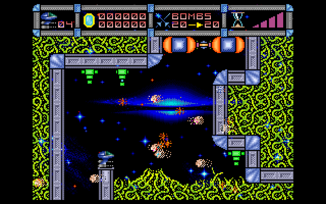
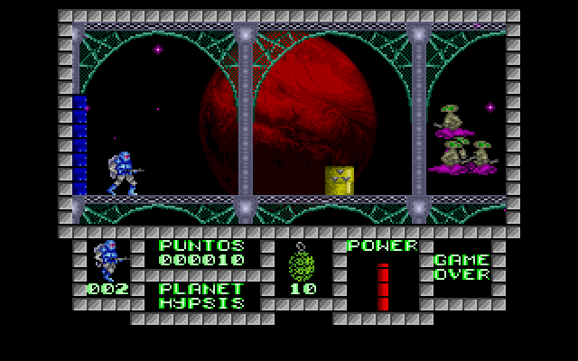

#### SPEC256
 

SPEC256: http://www.emulatronia.com/emusdaqui/spec256/download-eng.htm

игры: http://www.emulatronia.com/emusdaqui/spec256/download-eng.htm

редактор: http://kolmck.ru/apps/EmuZ/EmuZWin_Eng.htm

Демонстрационное видео:

build 20171030:
- Реализован фон F6 = Layer on/off

build 20171028:
- CPU: T80_GFX @ 3.5MHz
- RAM: 48K
- ROM: 16K ('82)
- VGA: 256x192 GFX256/Std (ZX Spectrum 48K)
- HDMI: 576P @ 49Hz
- Sound: Port 0xFE (Beeper)
- F1 Joystick on/off
- F2 = режим 256c
- F5 = MENU для загрузки игр
- Joystick: Kempston, Gamepad (Defender Game Master G2)
- Games: Abu Simbel, Army Moves, Army Moves 2, Cybernoid, Game Over, Game Over 2, JetPac, Knight Lore, Phantis, Sabre Wulf, Scooby Doo, Solomon's Key, Underwurlde

